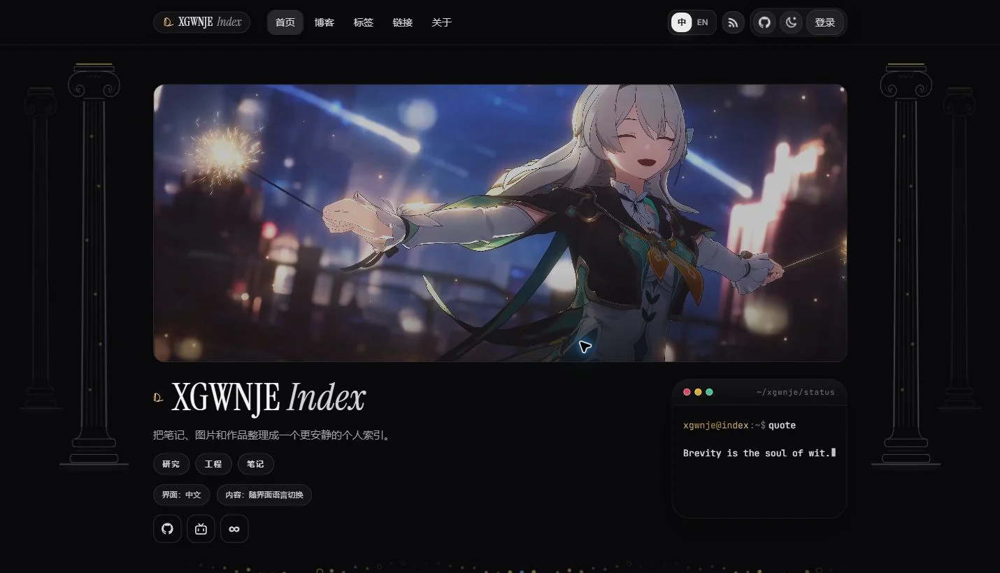
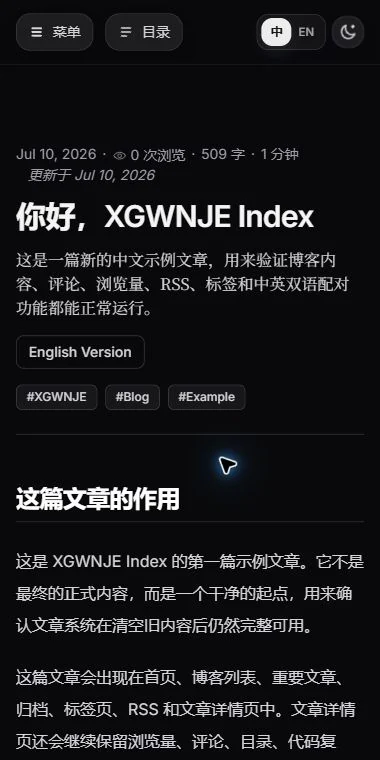
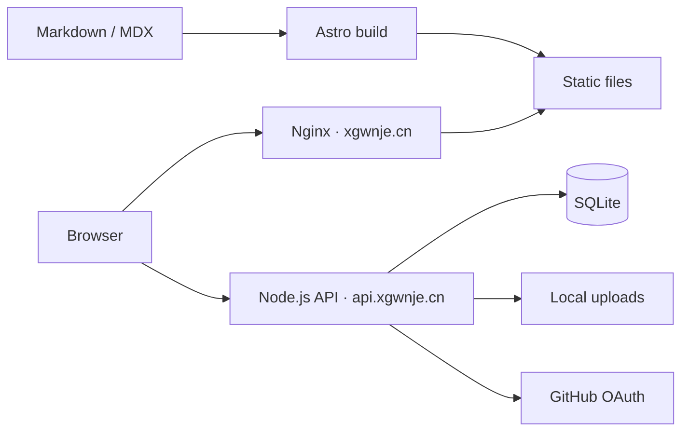

# XGWNJE

研究、工程与长期笔记的个人索引。前端使用 Astro 生成静态页面，交互能力由自托管的 Node.js + SQLite API 提供。

[在线主页](https://xgwnje.cn/) · [文章](https://xgwnje.cn/blog/) · [标签](https://xgwnje.cn/tags/) · [API 健康状态](https://api.xgwnje.cn/health)



<details>
<summary>移动端文章页预览</summary>



</details>

## 当前状态

| 部分 | 当前实现 |
| --- | --- |
| 前端 | Astro + Tailwind CSS，构建后由 VPS 上的 Nginx 托管 |
| 内容 | Markdown / MDX、双语文章配对、标签、归档、RSS |
| API | Node.js + Express，自托管于 `api.xgwnje.cn` |
| 数据 | SQLite 持久化用户、会话、评论、浏览量和联系消息 |
| 文件 | 上传图片由 API 的 `/uploads` 路径提供 |

生产入口为 `xgwnje.cn` 与 `api.xgwnje.cn`，前端和 API 都由当前 VPS 基础设施提供。

## 快速开始

需要 Node.js 22.12–24 与 npm 10–11。

```powershell
npm ci
npm run dev -- --host 127.0.0.1
```

本地站点默认位于 `http://127.0.0.1:4321/`。后端本地开发与环境变量说明见 [后端开发](./docs/backend-development.md)。

明确进行软件审查、后端改动或跨模块发布时运行完整验证：

```powershell
npm ci --prefix server
npm run verify
```

仅更新普通 Markdown 文章时，提交并推送文章、`public/image/blog/` 下的专用图片及 `public/file/blog/` 下的文章附件，然后运行一步快速通道：

```powershell
npm run publish:content
```

它会从生产 revision 建立隔离工作树，只叠加本次 Markdown 与文章附件后构建完整静态站，再上传变化文件并原子切换；仓库中其他未上线代码不会阻塞文章，也不会进入制品。快速通道不会重新发布 API、修改 Nginx 或执行全站浏览器检查。日常内容与回滚细节见 [站点维护](./docs/site-maintenance.zh-CN.md)。

## 核心能力

- 静态优先的首页、文章、标签、精选、链接与关于页面
- 中英文文章配对、语言切换、独立 RSS 订阅
- 桌面与移动端目录、相关文章、代码块和图片预览
- GitHub OAuth、邮箱登录、评论、浏览量、联系表单与用户设置
- SQLite 持久化与本地上传文件，不依赖托管数据库
- Sitemap、robots.txt、canonical、Open Graph 与 IndexNow 支持

## 架构



更完整的边界、数据流和部署决策见 [架构说明](./docs/architecture.md)。

## 常用入口

| 目标 | 位置 |
| --- | --- |
| 文章内容 | `src/content/blog/` |
| 页面与组件 | `src/pages/`、`src/components/` |
| 全局样式 | `src/styles/global.css`、`src/styles/tokens.css`、`src/styles/polish.css` |
| 后端源码 | `server/` |
| 日常维护 | [站点维护](./docs/site-maintenance.zh-CN.md) |
| 全部文档 | [文档地图](./docs/index.md) |

## 上游与许可证

前端基于 [Dancncn/DansBlog](https://github.com/Dancncn/DansBlog) 改造，保留对原作者和上游项目的署名。`XGWNJE/DansBlogs_worker` 仅作为上游 Worker 实现参考，当前生产后端以本仓库 `server/` 为准。

项目沿用 [MIT License](./LICENSE)。
