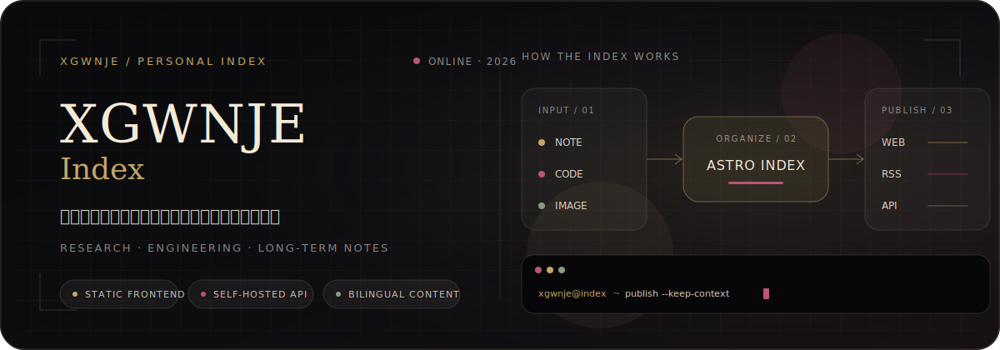
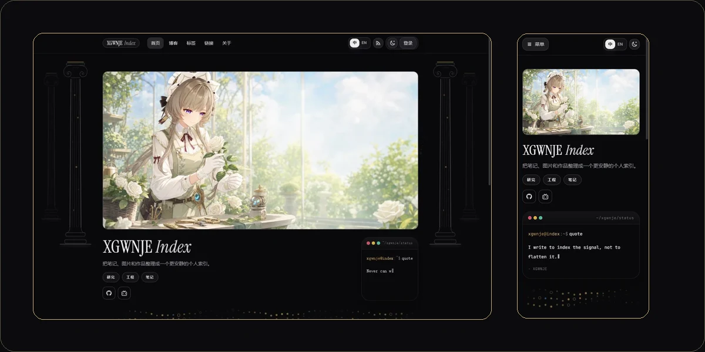
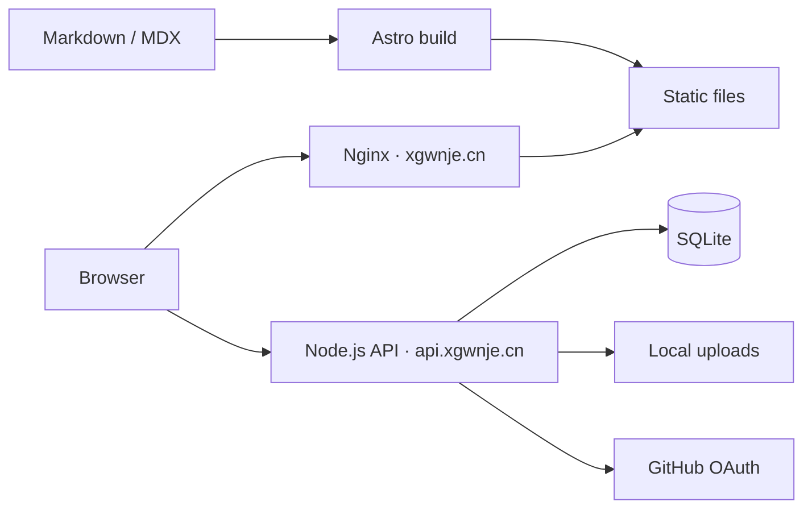

<p align="center">
  
</p>

<p align="center">
  <a href="https://xgwnje.cn/">在线主页</a> ·
  <a href="https://xgwnje.cn/blog/">文章归档</a> ·
  <a href="https://xgwnje.cn/tags/">主题索引</a> ·
  <a href="https://api.xgwnje.cn/health">API 状态</a>
</p>

<p align="center">
  
</p>

<p align="center">
  <sub>生产环境实拍：同一主页在桌面端与移动端的响应式呈现</sub>
</p>

## 一套可长期维护的个人索引

XGWNJE 把研究、工程实践、图片与长期笔记组织成可检索、可订阅、可持续发布的个人索引。它首先服务于真实内容，而不是一套待填充的通用博客模板；中英文内容、静态站点与自托管服务都在这个仓库里共同维护。

| 内容层 | 展示层 | 服务层 |
| --- | --- | --- |
| Markdown / MDX、中英文文章配对、标签、归档与 RSS | Astro + Tailwind CSS 生成静态页面，由 Nginx 托管 | Node.js + Express + SQLite 提供登录、评论、浏览量、联系表单与设置 |

## 架构



静态前端与交互服务彼此独立发布；SQLite 和上传文件作为持久数据保留，不随代码 release 替换。更完整的数据流与长期决策见 [架构说明](./docs/architecture.md)。

## 快速开始

需要 Node.js 22.12–24 与 npm 10–11。

```powershell
npm ci
npm run dev
```

本地站点默认位于 `http://localhost:4321/`。后端本地开发、环境变量与单独启动方式见 [后端开发](./docs/backend-development.md)。

### 发布普通文章

只更新文章及其图片、链接或附件时，使用内容快速通道：

```powershell
npm run publish:content
```

代码、配置或基础设施变更不会混入这条通道；完整的发布判定、验证和回滚方式见 [站点维护](./docs/site-maintenance.zh-CN.md)。

## 能力与边界

| 范围 | 当前实现 |
| --- | --- |
| 内容 | Markdown / MDX、双语配对、标签、归档、精选与独立 RSS |
| 阅读 | 桌面与移动端自适应目录、相关文章、代码块和图片预览 |
| 账户 | GitHub OAuth、邮箱登录、评论、浏览量、联系表单与用户设置 |
| 数据 | SQLite 持久化；上传图片由 API 的 `/uploads` 路径提供 |
| SEO | Sitemap、robots.txt、canonical、Open Graph 与 IndexNow |
| 管理 | 管理页面只接受有效的 Bearer 管理员会话 |

生产入口为 `xgwnje.cn` 与 `api.xgwnje.cn`。`XGWNJE/DansBlogs_worker` 只保留为上游 Worker 参考，并不是当前生产后端。

## 仓库地图

| 目标 | 位置 |
| --- | --- |
| 文章内容 | `src/content/blog/` |
| 页面与组件 | `src/pages/`、`src/components/` |
| 视觉系统 | `src/styles/`、[`docs/visual-system/`](./docs/visual-system/) |
| 自托管 API | `server/` |
| 项目架构 | [架构说明](./docs/architecture.md) |
| 前端与内容维护 | [站点维护](./docs/site-maintenance.zh-CN.md) |
| 后端本地开发 | [后端开发](./docs/backend-development.md) |
| 后端生产维护 | [后端维护](./docs/backend-maintenance.zh-CN.md) |
| SEO 配置 | [SEO 指南](./docs/seo-guide-zh-CN.md) |
| 全部文档 | [文档地图](./docs/index.md) |

## 上游与许可证

前端基于 [Dancncn/DansBlog](https://github.com/Dancncn/DansBlog) 改造，并保留对原作者和上游项目的署名。

项目沿用 [MIT License](./LICENSE)。
