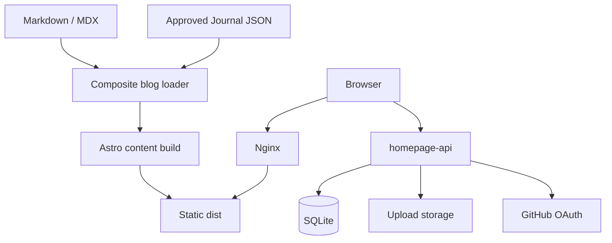

# HomePage 架构说明

## 系统边界

HomePage 由一个静态前端和一个独立 API 组成：

- Astro 的组合 blog loader 在构建期读取 `src/content/blog/` 和正式导入的 `src/content/human-agency/`，统一输出普通博客静态页面。
- Nginx 在 `xgwnje.cn` 提供静态页面。
- 浏览器直接请求 `api.xgwnje.cn` 上的 Node.js API。
- API 使用 SQLite 保存结构化数据，并使用独立持久目录保存上传文件。

共享服务器拓扑不在本仓库重复维护；真实 DNS、端口、Nginx 和 systemd 事实以本机 `D:\ObjectCode\Server-infra` 为准。

## 代码职责

| 位置 | 职责 |
| --- | --- |
| `src/content.config.ts` | 内容 schema |
| `src/content/blog/` | 双语文章源文件 |
| `src/content/human-agency/` | 已批准发布并正式导入的 Journal 文章源记录 |
| `src/content/humanAgencyLoader.ts` | 正式记录与显式 Journal 预览包的隔离验证器 |
| `src/content/blogWithJournalLoader.ts` | 将 Markdown 与 Journal 记录合并为普通 blog collection |
| `src/pages/` | Astro 路由 |
| `src/components/` | 页面组件和浏览器交互 |
| `src/layouts/BlogPost.astro` | 文章详情布局 |
| `src/data/` | 导航、链接、i18n 与语录数据 |
| `server/src/app.js` | HTTP 路由和应用逻辑 |
| `server/src/db.js` | SQLite schema、`user_version` 迁移与数据库适配 |
| `server/src/config.js` | 环境变量解析与运行配置 |

## 数据流

### 内容发布

1. 维护者添加一对中英文 Markdown / MDX 文件。
2. 内容 schema 校验 frontmatter。
3. Astro 构建页面、RSS 和 Sitemap。
4. `dist/` 作为不可变静态 release 发布。

### Journal 经验文章

1. Codex-Journal 在私有工作区核验事实、推断、人类增益与隐私风险。
2. 人工批准到 `approved-preview` 后，HomePage 可以通过显式 `JOURNAL_PREVIEW_PACKAGE` 在普通博客组件中预览。
3. loader 独立验证交换 Schema、批准状态和条目/包两层哈希，再将公开正文映射为 `category: 消化` 的普通博客文章。
4. 文章出现在 `/blog/digested/` 和 `/blog/<slug>/`，复用普通博客卡片、正文、RSS、归档和相关文章能力；不再存在独立展示板块。
5. 普通构建不读取外部包；只有 `approved-publish` 包能由显式 `journal:import --apply` 写入正式内容目录。
5. 中文认知节点可以独立存在；深度博客继续遵守现有 `group` 配对规则。

交换包不包含原始观察 ID、私有 claim、绝对路径、内部地址或审核事件。HomePage 不承担私有证据加工职责。

### 登录与交互

1. 浏览器通过 GitHub OAuth 或邮箱登录请求 API。
2. API 将 session 保存到 SQLite，并把 session token 返回给前端。
3. 前端使用 Bearer token 请求用户、评论、上传和受保护接口。
4. 浏览量、评论、联系消息、outbox 与上传元数据保存在 SQLite。

## 当前决策

### VPS/Nginx 是唯一生产部署

当前生产前端始终以站点根路径构建并发布到 VPS，服务端配置由 `Server-infra` 管理。构建配置中的兼容目标不构成生产发布流程，也不在运行手册中维护平台专用步骤。

### 数据与代码 release 分离

后端代码使用版本化 release；SQLite、上传文件和运行环境配置独立持久化。切换或回滚代码 release 时不得覆盖数据目录。

### 文章发布是受限的完整静态 release

文章更新会同时改变首页、博客列表、标签、RSS 与 Sitemap，因此生产端不增量覆盖单篇 HTML。`ContentOnly` 快速通道从线上 release manifest 取得生产 revision，只允许文章和 `public/image/blog/` 差异，通过后构建完整 `dist/` 并执行版本化原子切换。它不部署 API、不修改 Nginx；范围不纯或内容门禁失败时升级到普通前端或完整审查。

### 后台使用当前管理员会话

后台页面与管理 API 使用当前 Bearer session，不依赖 Cloudflare Access 注入头。权限边界必须同时满足：

1. 未登录和非管理员请求被拒绝。
2. 有效管理员可读取统计、评论、联系消息和 outbox，并执行审核操作。
3. API 自动测试与真实浏览器端到端验证都通过后，才可对外宣称后台完整可用。

### 图片 CDN 是条件能力

当前上传文件由 API 的 `/uploads` 路径提供。`img.xgwnje.cn` 不是已完成能力；只有 DNS、存储、迁移清单、缓存策略和回滚全部验证后才能启用。迁移外部文章时，在此之前保留原始图片 URL。

## 上游关系

前端来源是 [Dancncn/DansBlog](https://github.com/Dancncn/DansBlog)。`XGWNJE/DansBlogs_worker` 可用于理解上游 Worker 行为，但不能作为当前生产后端的事实来源。
