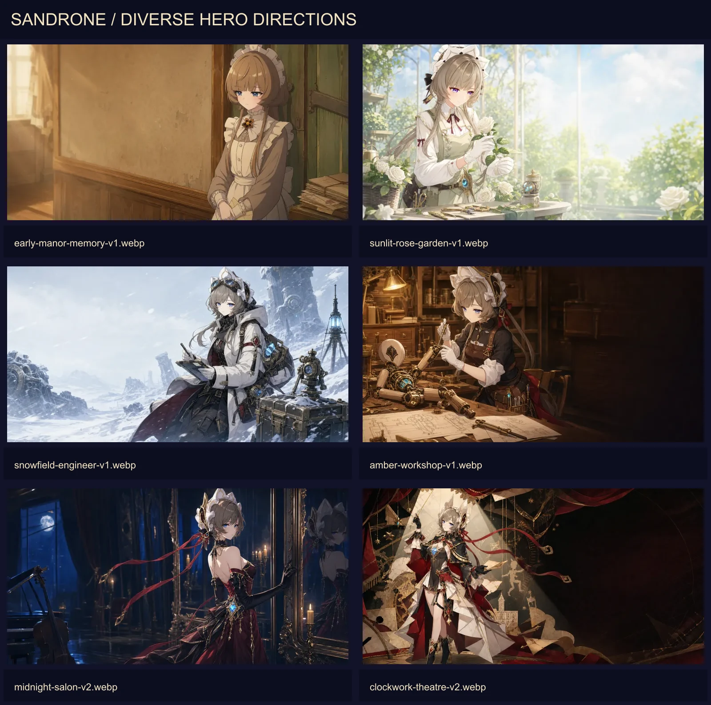

# 桑多涅多样化主视觉方向

第一批主视觉集中在“深色机械档案馆”，虽然构图不同，但时代、服装、色温和媒介过于接近。本轮把差异拆成四个独立变量：时期、场景、外层服装、表现媒介。

## 参考边界

本地官方资材能确认的主要时间差异只有两类：

- 早期回忆：较朴素的棕灰、奶油色侍从装束，头饰更接近传统布质女仆头巾，画面常带旧动画或纸本回忆质感。
- 现行形象：黑、白、深红礼装，白色大型头饰、金色机械结构与冰蓝核心更加完整。

雪原工程装、工坊工作装、夜宴礼服和剧场指挥服属于本站衍生概念，不宣称为官方时期或官方服装。无论换装如何变化，都保留灰棕发、蓝眼、头饰轮廓、冷静神态与机械核心等身份锚点。

## 六条主视觉路线

| 资产键 | 时期/设定 | 场景 | 服装与媒介 | 主要色调 |
| --- | --- | --- | --- | --- |
| `diverseHeroes.earlyManorMemory` | 早期回忆 | 旧宅走廊 | 朴素侍从服、旧动画纸本质感 | 暖褐、奶油、灰绿 |
| `diverseHeroes.sunlitRoseGarden` | 现行日常衍生 | 白玫瑰温室 | 轻便花园工作装、高明度插画 | 象牙白、浅绿、柔红 |
| `diverseHeroes.snowfieldEngineer` | 远行衍生 | 雪原遗迹 | 工程大衣、仪器箱、风雪叙事 | 冷青、炭黑、酒红 |
| `diverseHeroes.amberWorkshop` | 工作衍生 | 暖色工坊 | 工作裙、围裙、工具带 | 琥珀、木色、深蓝黑 |
| `diverseHeroes.midnightSalon` | 社交衍生 | 夜间镜厅 | 酒红晚宴长裙、月光与烛光 | 深酒红、月蓝、暗金 |
| `diverseHeroes.clockworkTheatre` | 幻想衍生 | 机械剧场 | 指挥礼服、舞台拼贴与纸艺 | 黑白红、聚光金 |

## 选用规则

1. 同一页面最多使用一条主视觉路线，不把不同时间和服装混成“全套元素集合”。
2. 主视觉必须为 HTML 标题保留安全区，不在图片中烘焙文字和按钮。
3. 早期回忆路线不得出现现行大型机械腰饰；现行衍生路线不得伪装成官方历史服装。
4. 花园路线使用高明度自然光；雪原路线使用冷自然光；工坊路线使用暖工作灯；夜宴路线使用月光与烛光；剧场路线允许非写实拼贴。不得全部重新压回暗红档案馆配色。
5. 新路线默认作为备用资产。接入页面前先确认正文色彩对比、桌面与移动裁切，并单独设置 `object-position`。
