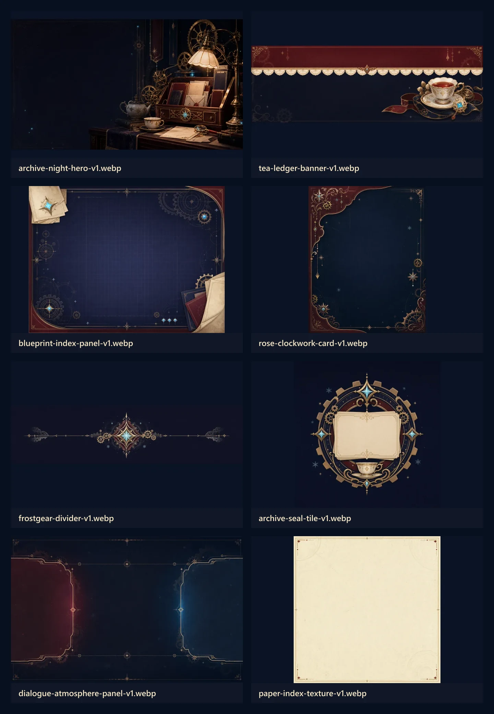
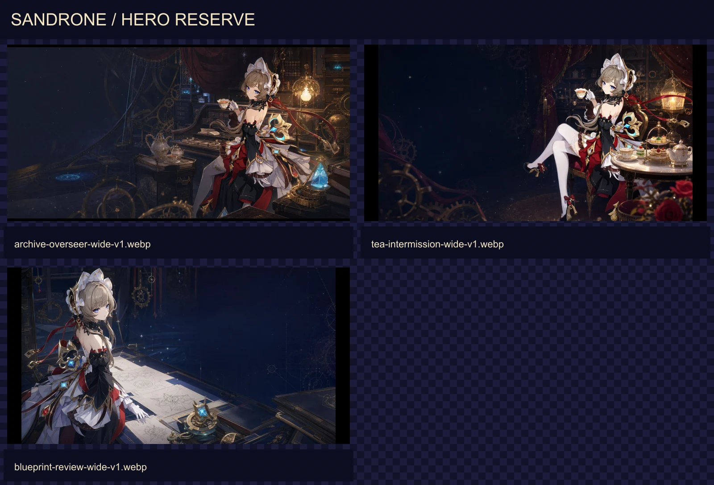
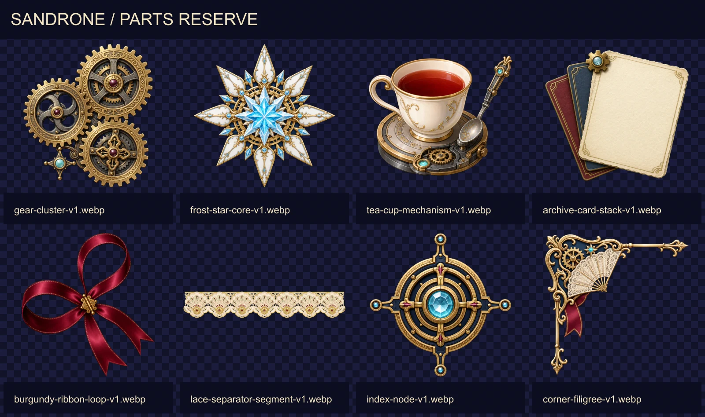
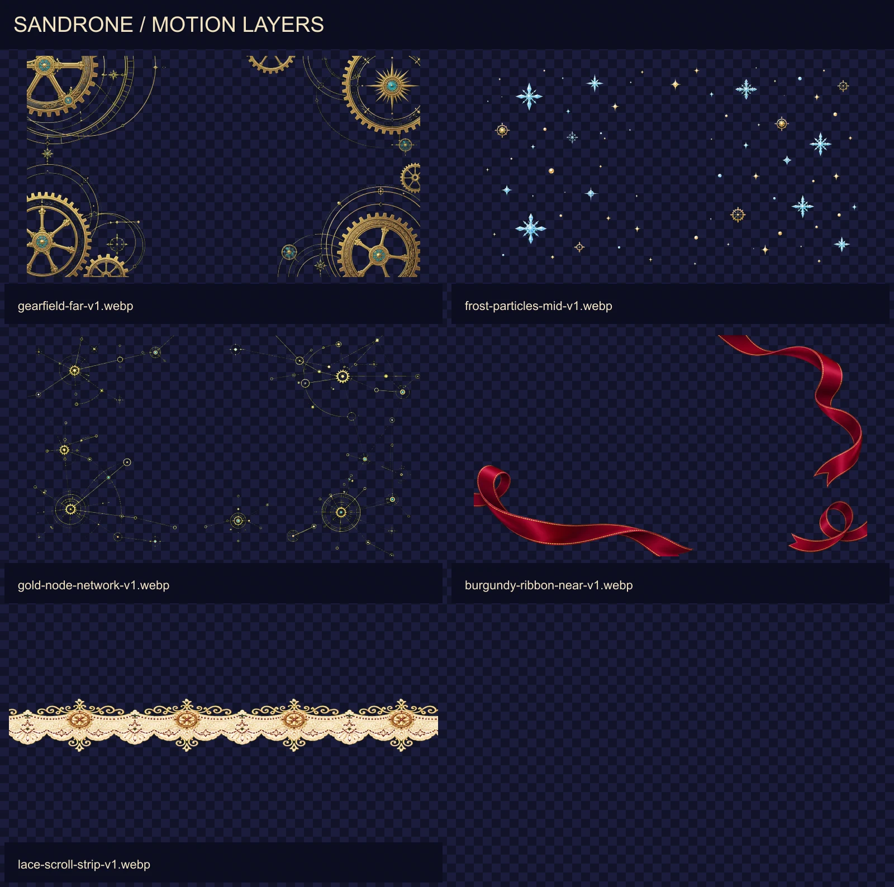

# 桑多涅视觉语言与备用资产

本文记录本站如何从手工整理的桑多涅参考资料中提取视觉语言，并约束后续生成资产的使用方式。参考资料用于研究，不等于可直接投放的站点资产。

## 参考范围

参考根目录：`references/visual/sandrone/`

当前共有 20 张图片：

- `官方视觉包装/`：6 张，负责版式、配色、纹理和装饰语法。
- `官方资材/`：10 张，负责角色面部、发型、头饰、服装层级和姿态校准。
- `同人二创/`：3 张，只用于观察构图可能性，不作为身份权威来源。
- `cos/`：1 张，只用于理解材质和结构，不作为角色绘制依据。

站点生成资产不得直接复制官方标题、Logo、角色档案字段、边框组合或专有徽记。官方资材中的角色形象只允许用于本站非商业、非官方衍生表达，并继续保留页面免责声明。

## 官方视觉包装的核心语法

### 1. 颜色不是“红黑金”三色，而是五层关系

| 语义 | 建议色值 | 用法 |
| --- | --- | --- |
| 档案夜色 | `#111329` | 页面深色底、长页连续背景 |
| 墨蓝面板 | `#1B1D3B` | 信息卡、蓝图与正文承载区 |
| 酒红章节 | `#6F2630` | 章节顶栏、强调面板、状态区 |
| 旧金结构 | `#C6A66A` | 细边、齿轮、标题和连接线 |
| 冰蓝状态 | `#A9E6F2` | 星雪、宝石、机械状态点 |
| 茶瓷暖白 | `#F4E5C0` | 蕾丝、茶具、局部高光 |

旧金只负责结构，不铺满大面积；冰蓝只承担状态和冷光，不发展成霓虹赛博风。酒红通常作为章节切换，墨蓝才是主要阅读底。

### 2. 版式由“章节—档案—批注”组成

- 顶部使用酒红章节带或拱形画框建立主题。
- 中段以墨蓝长页承载内容，穿插旧金细线、机械节点和小型星雪。
- 信息块常使用一角切入、角色破框、悬浮名牌和非对称装饰，不依赖普通矩形卡片。
- 蓝图模块使用低对比网格、线稿、索引标注和错位纸张层，表达“研究进行中”。
- 茶会模块使用暖白瓷器、蕾丝边和酒红布面，表达“秩序中的休息”，不走甜美下午茶路线。

### 3. 装饰词汇有明确层级

主词汇：齿轮、精密连接线、冰晶星芒、红色织带、茶杯、宝石状状态核心。

辅词汇：扇形蕾丝、菱形坠饰、细小雪花、低对比花纹、星点。

禁止扩展：霓虹线路、纯工业警戒条、蒸汽朋克铜管堆叠、哥特恐怖血迹、现代电子屏幕、通用 AI 脑网络图。

### 4. 字体与文字只是站点实现层

官方包装使用高对比中文标题、窄字距英文小写和宽字距角色名。本站只复用层级关系，不把官方图片中的文字烘焙进新资产：

- 图片资产保持无文字。
- 中文标题继续使用站点现有衬线字体体系。
- 英文眉题使用小字号、宽字距和全大写。
- 文案、日期和状态必须由 HTML 输出，保证可访问、可翻译、可响应。

## 角色身份不变量

- 灰棕色短发、蓝色眼睛、白色大型机械头饰。
- 黑、白、深红衣装层级，旧金框架与少量冰蓝机械状态光。
- 神态冷静、克制、略带挑剔；动作精准，不夸张卖萌。
- 不添加动物耳朵、眼镜、现代设备、陌生武器或替代服装。
- 普通形象保持正常比例；Q 版只简化比例，不改身份特征。

现有五张角色资产已经覆盖首页、About、索引、维护和对话场景，后续优先复用，不生成“换个动作但用途相同”的近似立绘。

## 当前正式角色资产

所有代码引用统一从 `src/data/visualAssets.ts` 获取。

| 资产键 | 用途 |
| --- | --- |
| `sandrone.heroGuide` | 首页首屏引导 |
| `sandrone.aboutObserver` | About 观察者主视觉 |
| `sandrone.indexAssistant` | 索引、空状态、分类辅助 |
| `sandrone.maintenanceAssistant` | 404、维护、错误状态 |
| `sandrone.dialogChibi` | 对话、批注、小尺寸装饰 |
| `mascot.ownerDialog` | 站长黑猫对话形象 |

## 备用包装资产

备用资产位于 `public/image/sandrone/reserve/`，默认不直接进入页面。使用前先在目标视口预览，再通过 `visualAssets.sandrone.reserve` 引用。

| 资产键 | 适合场景 | 不适合场景 |
| --- | --- | --- |
| `archiveNightHero` | 首页备选 Hero、专题页头图 | 小卡片背景 |
| `teaLedgerBanner` | 茶会、随笔、轻内容横幅 | 错误状态 |
| `blueprintIndexPanel` | 项目规划、索引、研究进度 | 大段正文底图 |
| `roseClockworkCard` | 竖向专题卡、About 辅图 | 文章列表重复铺设 |
| `frostgearDivider` | 章节分隔、页尾过渡 | 导航栏 |
| `archiveSealTile` | 空状态图标、专题入口 | 站点 Logo 或 favicon |
| `dialogueAtmospherePanel` | 对话专题、角色互动背景 | 普通文章正文 |
| `paperIndexTexture` | 索引卡、纸张质感、浅色局部 | 全屏强对比背景 |

## 扩展备用资产

扩展资产仍然位于 `public/image/sandrone/reserve/`，但按职责拆分为 `heroes/`、`parts/` 和 `motion/`。页面不得从联系表或研究目录裁图使用。

### 主视觉

| 资产键 | 构图与用途 |
| --- | --- |
| `heroes.archiveOverseer` | 2:1 档案馆主视觉，角色在右、左侧留给 HTML 标题；适合首页、专题页首屏 |
| `heroes.teaIntermission` | 16:9 茶歇主视觉，气氛更安静；适合随笔、阶段总结与低密度内容 |
| `heroes.blueprintReview` | 16:9 蓝图审阅主视觉；适合项目、研究、更新记录和方法说明 |

主视觉图不得烘焙标题、按钮或日期。裁切时优先保持角色面部、机械头饰和手部动作完整，文字始终放在预留安全区。

### 多样化主视觉

第二组主视觉不再共享同一套暗色档案馆包装，而是按早期旧宅、日光花园、雪原工程、暖色工坊、夜间沙龙和机械剧场分别建立场景、服装与媒介。详细参考边界和选用规则见 [桑多涅多样化主视觉方向](./sandrone-diverse-hero-directions.zh-CN.md)。

### 小零件

| 资产键 | 推荐用途 |
| --- | --- |
| `parts.gearCluster` | 卡片外沿、章节节点、空状态机械装饰 |
| `parts.frostStarCore` | 状态点、分隔中心、轻提示高光 |
| `parts.teaCupMechanism` | 茶会、随笔与休息状态的主题装饰 |
| `parts.archiveCardStack` | 索引、归档、待整理内容的角落装饰 |
| `parts.burgundyRibbonLoop` | 角色名牌、章节转折和边缘引导 |
| `parts.laceSeparatorSegment` | 短分隔线、标题下沿；需要更长时由 CSS 重复，不拉伸纹样 |
| `parts.indexNode` | 时间线、目录、蓝图和关系图节点 |
| `parts.cornerFiligree` | 面板单角收边；禁止四角同时堆叠 |

小零件是透明前景，不得被当成图标语义。交互按钮仍使用站点图标系统；这些零件只承担装饰。

### 动画分层素材

| 资产键 | 层级 | 推荐运动 |
| --- | --- | --- |
| `motion.gearfieldFar` | 远景 | `40–90s` 极慢旋转或 `1–2%` 缩放，低透明度 |
| `motion.frostParticlesMid` | 中景 | `12–30s` 小幅漂移、呼吸与反向视差 |
| `motion.goldNodeNetwork` | 中景结构 | `25–60s` 缓慢位移或局部遮罩显隐，不做快速闪烁 |
| `motion.burgundyRibbonNear` | 近景边缘 | `16–36s` 小幅摆动，保持中心阅读区净空 |
| `motion.laceScrollStrip` | 横向过渡 | `30–80s` 无缝横移，或作为静态章节收边 |

动画素材用于补充现有 `MeteorShower`、`GoldenSpiral` 和 `ParthenonColumns`，不是替换它们。新增背景组件必须保持 `aria-hidden="true"`、`pointer-events: none`、独立层级和隐藏标签页暂停；远、中、近景最多各选一张，不把五层同时铺满。

当 `prefers-reduced-motion: reduce` 生效时，停止位移、旋转和粒子循环，只保留一张低透明度静态远景；不得通过修改设备宽度绕过系统动态效果偏好。

## 生成规则

1. 新资产先定义唯一用途；已有资产能覆盖时禁止重新生成。
2. 包装资产不得包含文字、角色肖像、Logo、签名或官方专有徽记。
3. 一张资产只承担一种主要构图，不从拼图裁切多个交付物。
4. 生成结果必须进入 `visualAssets.ts` 后才能被页面使用。
5. 透明资产优先避免细发丝、玻璃和烟雾；必须透明时按 imagegen Skill 的色键与边缘验收流程处理。
6. 新资产不得覆盖旧文件；使用 `-v2` 等版本名，确认替换后再清理旧引用。
7. 每次只在受影响页面做定向浏览器验证；发布前再执行完整矩阵。

## 权利边界

这些视觉资产是基于《原神》角色与官方视觉包装研究形成的非官方衍生内容，仅用于本站个人、非商业展示。不得暗示 HoYoverse 或《原神》官方参与、授权或背书。若站点转为商业用途，必须重新评估全部角色与衍生资产。
